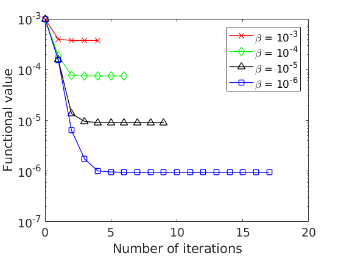
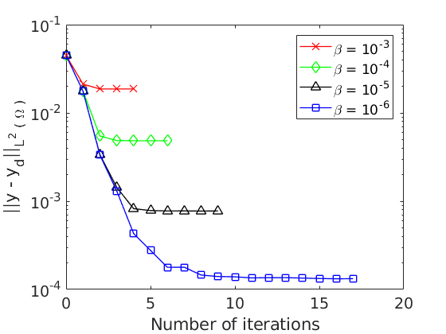

# Interior Control of the Poisson Equation with the Steepest Descent Method in OpenFOAM

In this work we solve the optimal control problem

<p align="center">
  
</p>

where  is the control variable,  the state variable and  a target function. The minimization problem is subject to the elliptic partial differential equation

<p align="center">
    
</p>

In order to use the conjugate gradient method, the state variable is separated in two terms as

<p align="center">
    
</p>

where  solves the state equation with zero Dirichlet boundary conditions,

<p align="center">
    
</p>

and  is the control-free solution to the state equation,

<p align="center">
    
</p>

## Getting Started

The solver must be compiled in the terminal. It is advisable to first clean previous compilations with

```
wclean
```

and then use

```
wmake
```

### Prerequisites

OpenFOAM C++ library must be installed in order to compile the code.

The OpenFOAM distribution provided by the [OpenFOAM Foundation](https://openfoam.org/) was used.

## Running a Case

In order to run the solver move to the case folder _poissonCGAdjoinFoamCase_ and type in the command line

```
./Allprepare

poissonCGAdjointFoam
```

<p align="center">
  
</p>

<p align="center">
  
</p>

### Warning

It might be needed to use 

```
sed -i -e 's/\r$//' filename
```

and

```
chmod +x filename
```

in order to be able to execute 

```
./filename
```

## Author

* **Jose Lorenzo Gomez**
* **Víctor Hernández-Santamaría**

## Acknowledgments

This project has received funding from the European Research Council (ERC) under the European  Union’s Horizon 2020 research and innovation programme (grant agreement No. 694126-DyCon).
 
[DyCon Webpage](http://cmc.deusto.eus/dycon/)

## References

* F. Tröltzsch. _Optimal control of partial differential equations: theory, methods, and applications_. American Mathematical Soc., 2010.
